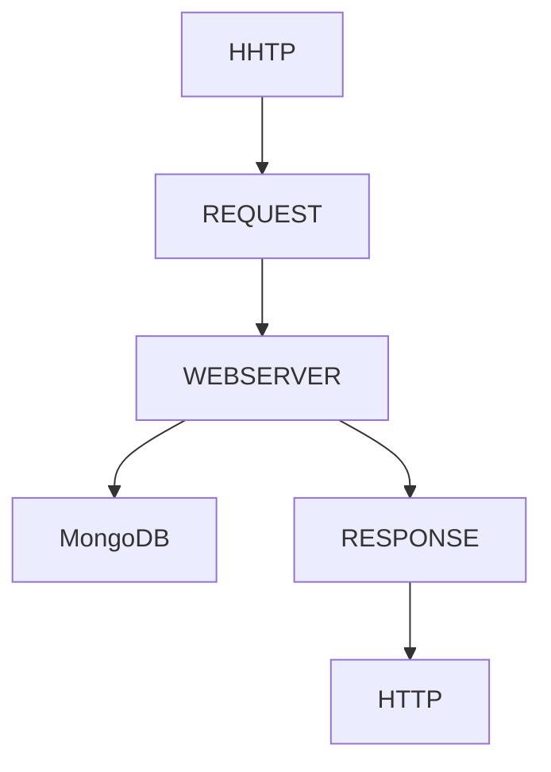

# Titulo
## Otro subtitulo 1
### Otro subtitulo 2
#### Otro subtitulo 3
##### Otro subtitulo 4
###### Otro subtitulo 5


texto <br>
**texto en negrita**<br>
*texto en cursiva*<br>
***texto en negrita y cursiva***<br>
~~texto tachado~~<br>
>para citar texto<br>

Lista 1:
- [ ] item1
- [x] item2
- [ ] item3

Lista 2:
- item1
  - subitem 1.1
  - subitem 1.2
    - subitem 2.1
- item2
- item3

Lista 3:
1) item1
2) item2
3) item3

## Tabla:
| Col1 | Col2 | Col3 |
| ---- | ---- | ---- |
| Fila1 Col1 | Fila1 Col2 | Fila1 Col3 |
| Fila2 Col1 | Fila2 Col2 | Fila2 Col3 |
| Fila3 Col1 | Fila3 Col2 | Fila3 Col3 |
| GET | http://127.0.0.1:3000/coches | Trae todos los coches |


[Hypervinculo](https://i.blogs.es/d5130c/wallpaper-2.png/1366_2000.jpeg)




***Javascript(indicamos el lenguaje del codigo citado)***
```
//PARA CITAR CODIGO
server.post('/login', (req, res) => {
    const { username, password } = req.body;
    if(username === user.username && password === user.password){
        return res.status(200).send({token: generateToken(username,user.isAdmin)});
    }
    res.status(401).send("Credenciales invalidas");
});
```